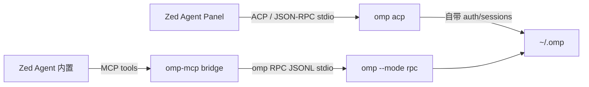

# omp-acp — Oh My Pi (omp) 的 Zed 插件

把 [Oh My Pi](https://omp.sh/)（omp）完整接入 Zed 的 Agent Panel，提供**两层集成**：

1. **External Agent（ACP）**：`omp acp` 作为 Zed 外部代理注册，在 Agent Panel 里以 `OMP` 线程运行——模型认证、工具、会话全部由 omp 自己管理，体验与 Zed 内置 Agent 一致（线程历史、工具指示器、MCP 转发等）。
2. **MCP context server（omp-mcp）**：扩展贡献 `omp` context server，一个 Node 桥（`bridge/server.cjs`）在每个项目里托管常驻的 `omp --mode rpc` 子进程，把 omp 暴露成 Zed Agent（内置）可直接调用的 MCP 工具——用于委派任务、续接会话。



## 环境要求

- Zed ≥ 1.5（在 1.14 上开发验证）
- omp（`omp acp` 与 `omp --mode rpc` 可用）
- Node ≥ 18（桥由 Zed 自带的 Node 运行，安装脚本需要 PATH 上的 node）

## 安装

```powershell
# 1. 一键安装：定位 omp → 复制桥脚本 → ACP 握手自检 → 合并 Zed 设置（自动备份）
cd <本仓库>
.\scripts\install.ps1

# 可选参数
.\scripts\install.ps1 -OmpPath "C:\path\to\omp.exe" -Model "opencode-go/deepseek-v4-flash" -AutoConfirm
```

```text
# 2. 在 Zed 中安装扩展本体（一次性，UI 操作）
#    Command Palette -> `zed: install dev extension` -> 选择本仓库目录
#    然后重启 Zed（或 `zed: reload workspace`）
```

安装脚本写入（`%APPDATA%\Zed\settings.json`，原文件备份为 `settings.json.omp-acp.bak`）：

```jsonc
{
  "agent_servers": {
    "omp": { "type": "custom", "command": "<omp 路径>", "args": ["acp"] }
  },
  "context_servers": {
    "omp": { "enabled": true, "remote": false, "settings": {} }
  }
}
```

## 使用

### OMP 线程（External Agent）

Agent Panel → New Thread → 选 **OMP**。线程由 omp 驱动：模型/认证/工具遵循 omp 自己的配置（`~/.omp`），Zed 负责线程 UI、历史、工具指示器。Zed 里配置的 MCP server 会经 ACP 转发给 omp。

### MCP 工具（委派给 omp）

安装扩展后，在 Zed 的 **Settings → AI → MCP Servers** 确认 `omp` 显示为 active（绿色）。然后在内置 Zed Agent 的线程里，模型可调用：

| 工具 | 作用 |
|---|---|
| `omp_run` | 把任务委派给 omp 在**当前项目**里执行（全新会话），流式返回最终文本。支持 `images` 参数附带本地图片（png/jpg/jpeg/gif/webp/bmp/svg，单张 ≤15MB）。适合大重构、多文件调查、需要 omp 工具链（read/bash/edit/task/web_search…）的活 |
| `omp_continue` | 切到该项目**最近一次** omp 会话并可选续接指令（同样支持 `images`） |
| `omp_status` | omp 版本、当前模型、会话文件、上下文占用 |
| `omp_models` | omp 可用模型列表 |
| `omp_sessions` | 项目最近的会话文件 |
| `omp_abort` | 中止进行中的运行 |

代理面板还提供 `omp-run` / `omp-continue` 两个 MCP prompt 模板。

## 配置（`context_servers.omp.settings`）

```jsonc
"context_servers": {
  "omp": {
    "enabled": true,
    "remote": false,
    "settings": {
      "ompPath": "C:\\Users\\you\\AppData\\Local\\omp\\omp.exe", // 默认: PATH 上的 omp
      "model": "opencode-go/deepseek-v4-flash",                   // 默认: omp 自身默认模型
      "autoConfirm": false,                                       // 默认 false!
      "timeoutMs": 600000,                                        // omp_run 默认超时
      "sessionDir": "C:\\path\\to\\sessions",                     // 默认 ~/.omp/agent/sessions
      "bridgePath": "C:\\path\\to\\bridge\\server.cjs",           // 默认 ~/.omp/zed/bridge.cjs；Windows 上必填（安装脚本自动写入）
      "extraArgs": ["--profile", "zed"]                           // 附加到 `omp --mode rpc`
    }
  }
}
```

> **安全说明**：`autoConfirm` 默认关闭。omp 运行中弹出的确认/询问对话框会被桥**拒绝**（`confirm` 应答 `no`，`select` 取第一项，`input` 填空）并记录日志，避免未经确认的写操作。确实需要无人值守时再开 `autoConfirm`，或按单次运行传 `autoConfirm: true`。

## 卸载

```powershell
.\scripts\uninstall.ps1        # 移除 settings 条目 + 桥脚本
# Zed 内：Extensions 面板移除 omp-agent；删除本仓库目录
```

## 测试

```bash
node test/bridge-smoke.cjs [--omp <path>]   # MCP 冒烟：握手/工具/真实 omp_run/continue/sessions
node scripts/acp-handshake.cjs [-omp <path>] # ACP initialize 握手自检
cargo build --release --target wasm32-wasip2 # 编译扩展 WASM
```

## 目录结构

```
omp-acp/
├── extension.toml            # 扩展清单（id=omp-agent，注册 context_servers.omp）
├── src/lib.rs                # WASM 扩展：context_server_command（node -e 加载器）+ /omp 斜杠命令
├── bridge/server.cjs         # MCP↔omp RPC 桥（零依赖 Node）
├── scripts/
│   ├── install.ps1 / uninstall.ps1
│   ├── merge-settings.cjs    # JSONC 安全合并 Zed 设置（含尾部逗号/注释处理）
│   └── acp-handshake.cjs     # ACP v1/v2 initialize 握手自检
├── test/bridge-smoke.cjs     # 端到端冒烟测试
└── docs/COMPARISON.md        # omp Agent vs Zed Agent 功能对比
```

## 设计说明与已知边界

- **WASM 沙箱无 FS/交互 stdio**：扩展无法解析 `$HOME` 或常驻子进程，因此 context server 通过用户级固定路径（`~/.omp/zed/bridge.cjs`，可用 `bridgePath` 覆盖）落地桥脚本。
- **Windows 上必须直启桥文件（`node <bridgePath>`），不能用 `node -e` 加载器**：Zed 在 Windows 上用 `cmd.exe /S /C` 包装所有 stdio context server 命令，并对参数做 caret 转义；`node -e` 加载器里的 `|`、`(`、`)`、换行会被 cmd 截断/拆分，node 根本起不来，Zed 报 `Context server request timeout`。因此扩展优先使用 settings 里的 `bridgePath` 直启桥文件（普通路径无 shell 特殊字符，可安全穿过包装）；`install.ps1` 会自动写入该设置。未配置 `bridgePath` 时回退到 `node -e` 加载器（macOS/Linux 可用，Windows 上会启动失败）。
- **桥按项目常驻**：Zed 以项目根为 cwd 启动 context server，omp 以 `--cwd <项目根>` 运行，会话天然按项目隔离。
- **omp 的 ACP 是 v1**：`omp acp` 对 initialize 应答 `protocolVersion: 1`，Zed 会协商降级，正常可用（已在 1.14.2 验证握手）。
- **发布注意**：扩展 id `omp-agent` 符合 Zed 注册表规则（不含 `zed`/`extension` 字样）；MCP 扩展（含 context server 扩展）官方计划逐步迁移到 MCP 官方注册表（见 [tracking issue](https://github.com/zed-industries/zed/issues/59351)），本扩展的外部代理部分（ACP）不受影响。
